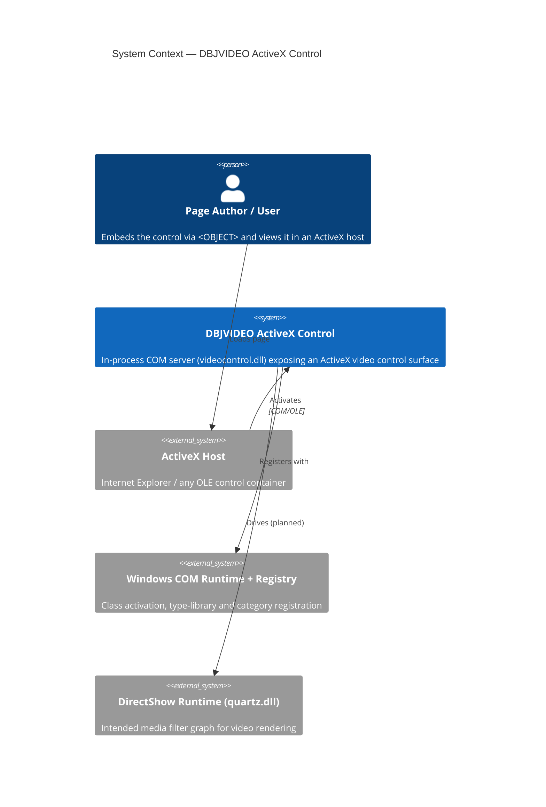
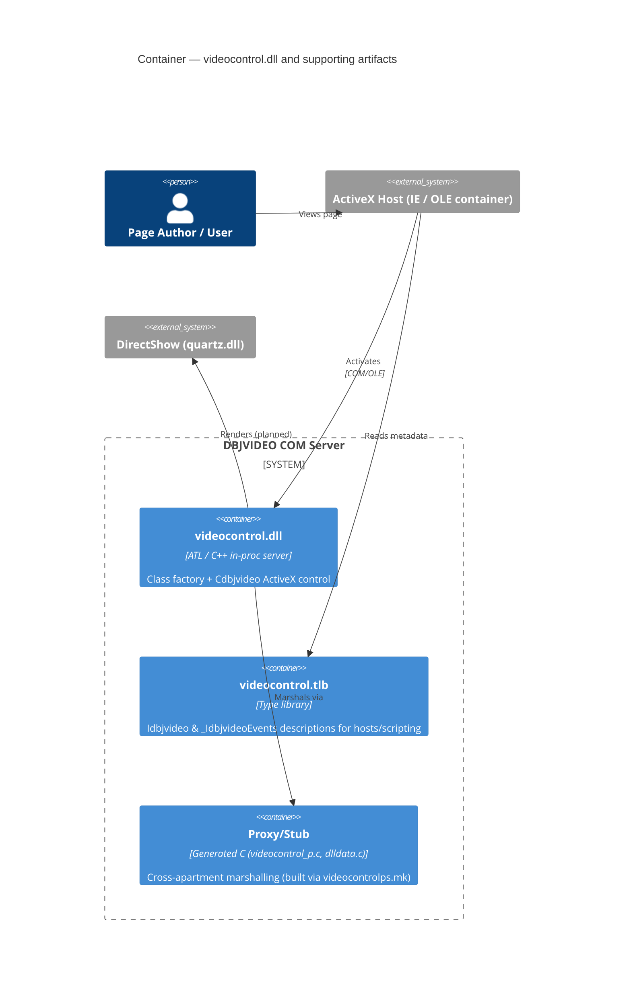
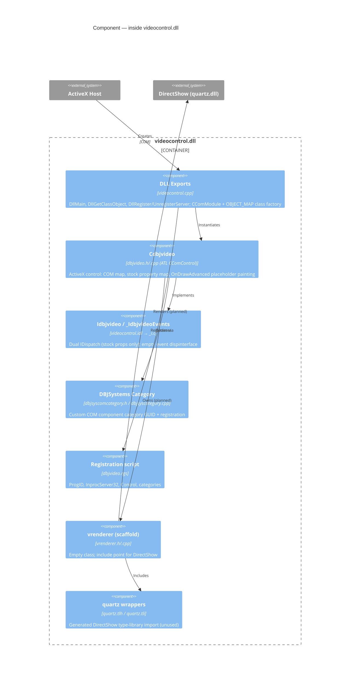

# videocontrol by dbj.systems (circa 2005)

`DBJVIDEO` — an ATL-based ActiveX control (COM/OLE) by DBJSystems Ltd, intended
to embed video rendering in a web page (Internet Explorer) or any ActiveX host.
The control is built as a Windows in-process COM server (`videocontrol.dll`).

- **Language:** C++ (ATL / COM)
- **Component type:** In-process ActiveX control (windowed, `m_bWindowOnly = TRUE`)
- **Primary interface:** `Idbjvideo` (dual `IDispatch`)
- **Event interface:** `_IdbjvideoEvents` (currently empty)
- **CLSID:** `A3014D0A-95BE-4440-8D05-BEBC1117EBC6`
- **ProgID:** `DBJSYS.VIDEOCTL.1`
- **Type library:** `VIDEOCONTROLLib` (`7C4D00BD-B7D6-4EFF-A98D-D7BC0D9B733C`)
- **Categories:** Safe for Scripting, Safe for Initializing, plus a custom
  *DBJSystems LTD COM* component category
- **Toolchain:** originally Visual C++ 7 (VS .NET 2003); ships both legacy
  `.dsp`/`.dsw` (VC6-style) and `.sln`/`.vcproj` (VS2003) project files

## Current state (review summary)

This repository is a **freshly generated ATL ActiveX skeleton** plus a stubbed
DirectShow integration point. Be aware before building on it:

- `Idbjvideo` exposes **only stock properties** — `BorderStyle`, `BorderWidth`,
  `HWND`, `MousePointer`, `MouseIcon`, `Picture`. There are no custom
  video-playback methods or properties (no source/URL, play, stop, seek).
- `Cdbjvideo::OnDrawAdvanced` paints a **placeholder rectangle** with its edge
  coordinates as text — it does not render video.
- `vrenderer` (`vrenderer.h`/`.cpp`) is an **empty class** (default
  constructor/destructor only). It `#include`s the DirectShow type-library
  wrapper `quartz.tlh`, but **no DirectShow interface is referenced anywhere**
  in the code (`IGraphBuilder`, `IMediaControl`, `IVideoWindow`, `IBasicVideo`,
  etc. are all unused).
- `_IdbjvideoEvents` declares no events.

In short: the **ActiveX/COM container scaffolding is complete and functional**
(registration, hosting, drawing surface, stock properties), but the
**DirectShow video pipeline is a planned integration that is not yet wired up**.
The diagrams below mark that boundary explicitly (dashed edges / "scaffold").

## Architecture (C4)

### Level 1 — System Context

Who and what the control interacts with at runtime.



### Level 2 — Container

The single deployable in-process server and its supporting artifacts.



### Level 3 — Component

Inside `videocontrol.dll`.



> **C4 Code level (Level 4)** is intentionally omitted — at this stage the
> implementation is thin (a single control class plus generated ATL/MIDL
> boilerplate), so the Component level already reflects the meaningful code
> structure.

## Repository layout

| Path | Role |
| --- | --- |
| `videocontrol/dbjvideo.h` / `dbjvideo.cpp` | The ATL ActiveX control `Cdbjvideo` (interface maps, property map, drawing) |
| `videocontrol/videocontrol.idl` | IDL defining `Idbjvideo`, `_IdbjvideoEvents`, `coclass dbjvideo` and the type library |
| `videocontrol/videocontrol.cpp` | DLL exports, `CComModule`, class object map (server entry points) |
| `videocontrol/vrenderer.h` / `vrenderer.cpp` | DirectShow renderer — **stub** (intended integration point) |
| `videocontrol/quartz.tlh` / `quartz.tli` | Generated DirectShow (`quartz.dll`) type-library wrappers |
| `videocontrol/dbjsyscomcategory.h` / `dbjsyscategory.cpp` | Custom *DBJSystems* COM component category GUID |
| `videocontrol/dbjvideo.rgs` | Registry script (ProgID, `InprocServer32`, control, categories) |
| `videocontrol/videocontrol_i.c` / `_p.c` / `dlldata.c` | MIDL-generated GUIDs and proxy/stub marshalling code |
| `videocontrol/videocontrol.{sln,vcproj}` / `{dsw,dsp}` | VS2003 and legacy VC6-style project files |
| `videocontrol/videocontrol.htm`, `dbjvideo.htm` | Sample HTML pages embedding the control via `<OBJECT>` |
| `videocontrol/StdAfx.h` / `StdAfx.cpp` | Precompiled-header / ATL module setup |

## Building

Open `videocontrol/videocontrol.sln` (or the legacy `videocontrol.dsw`) in a
Visual C++ environment with the DirectShow SDK (`quartz` / Windows SDK headers)
available, and build the `videocontrol` ATL DLL project. To build a separate
proxy/stub DLL, run `nmake -f videocontrolps.mk` in the project directory.

## Registering

The built DLL is a COM in-process server and must be registered before use:

```
regsvr32 videocontrol.dll
```

`DllRegisterServer` registers the coclass, type library, all interfaces in the
type library, and the custom DBJSystems component category. Use
`regsvr32 /u videocontrol.dll` to unregister.

## Hosting

Embed in an ActiveX host (e.g. Internet Explorer) via an `<OBJECT>` tag keyed on
the CLSID — see `videocontrol/videocontrol.htm`:

```html
<OBJECT id=dbjvx style="WIDTH: 754px; HEIGHT: 310px"
        classid="clsid:A3014D0A-95BE-4440-8D05-BEBC1117EBC6">
</OBJECT>
```

## Authors

- Mahmudul Hoque — `mhoque@gmail.com`
- Dusan Jovanovic — `dbjdbj@gmail.com`
